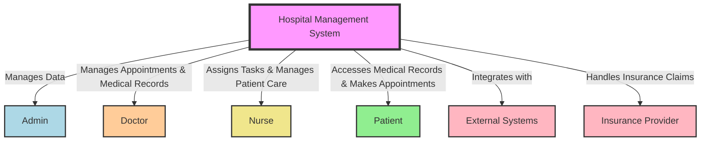
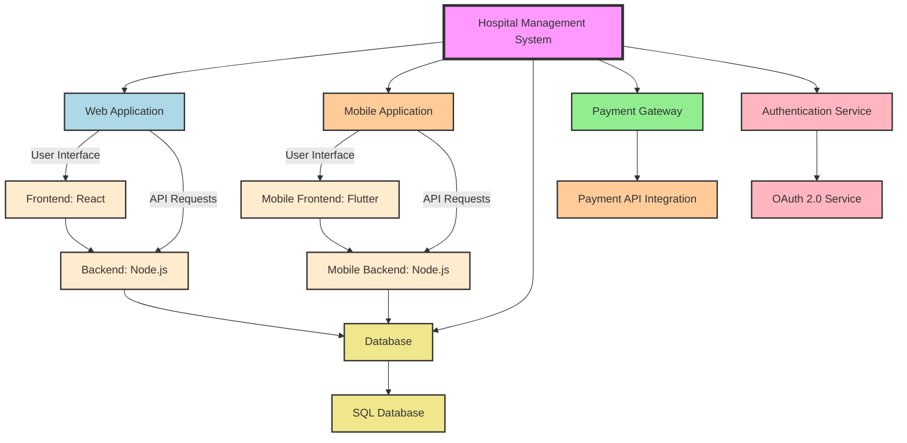
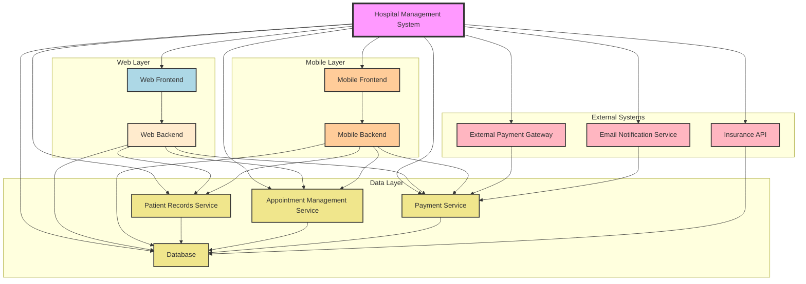

# System Context Diagram


# System Container Diagram



# System Component Diagram



# System Component Diagram

```mermaid

classDiagram
    class Patient {
        +String patientId
        +String name
        +String dob
        +String gender
        +String contactInfo
        +String address
        +String medicalHistory
        +String allergies
        +registerPatient()
        +updatePatientInfo()
    }

    class Doctor {
        +String doctorId
        +String name
        +String specialty
        +String contactInfo
        +String schedule
        +String department
        +addDoctor()
        +updateDoctorSchedule()
    }

    class Appointment {
        +String appointmentId
        +String date
        +String time
        +String status
        +String doctorId
        +String patientId
        +scheduleAppointment()
        +cancelAppointment()
    }

    class Prescription {
        +String prescriptionId
        +String patientId
        +String doctorId
        +String medicationDetails
        +String dosage
        +generatePrescription()
    }

    class Bill {
        +String billId
        +String patientId
        +Double amount
        +String paymentStatus
        +generateBill()
        +updateBillStatus()
    }

    class Ward {
        +String wardId
        +String wardName
        +String capacity
        +String availableBeds
        +String department
        +assignPatientToWard()
        +dischargePatient()
    }

    class Hospital {
        +String hospitalId
        +String name
        +String address
        +String contactInfo
        +addPatient()
        +assignDoctor()
        +manageAppointments()
        +processBilling()
    }

    Patient "1" --> "*" Appointment : has
    Patient "1" --> "*" Bill : has
    Patient "1" --> "1" Prescription : receives
    Doctor "1" --> "*" Appointment : handles
    Doctor "1" --> "*" Prescription : writes
    Hospital "1" --> "*" Patient : manages
    Hospital "1" --> "*" Doctor : manages
    Hospital "1" --> "*" Ward : manages
    Ward "1" --> "*" Patient : accommodates
    Hospital "1" --> "*" Bill : processes

