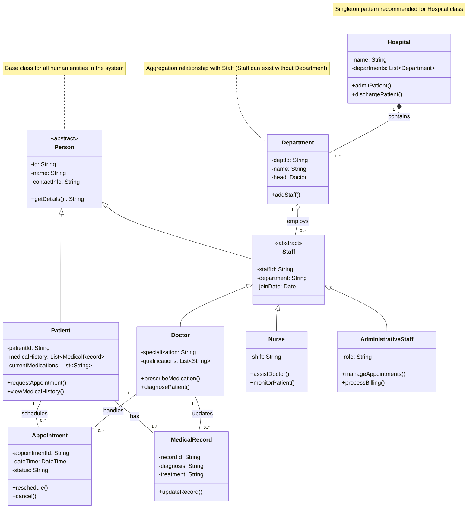

# Key Design Decisions:
**Inheritance Hierarchy:**

Used abstract Person class as base for both patients and staff

Created specialized staff types (Doctor, Nurse, Administrative) through inheritance

**Composition vs Aggregation:**

Hospital-Department is composition (departments can't exist without hospital)

Department-Staff is aggregation (staff can exist without department)

**Multiplicity:**

A patient can have multiple appointments (0..*) but each appointment belongs to one patient

Doctors can update multiple medical records but each record is tied to one patient

**Abstract Classes:**

Marked Person and Staff as abstract to prevent direct instantiation

Used UML stereotypes (<<abstract>>) for clarity

**Collections:**

Used List notation (List~Type~) for multi-valued attributes

**Notes:**

Added explanatory notes for complex relationships

Suggested Singleton pattern for Hospital class
