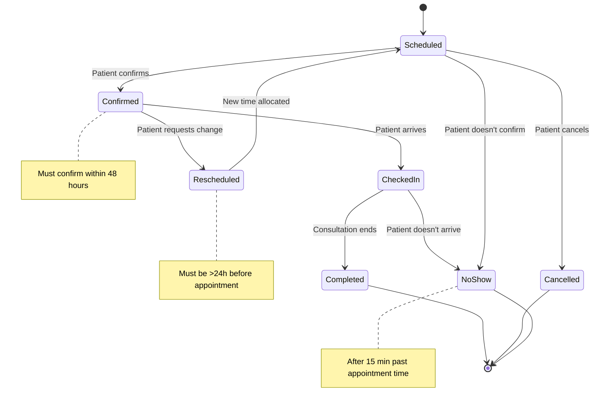

# Appointment Object

**Key States:** Scheduled, Confirmed, CheckedIn, Completed, Cancelled, NoShow, Rescheduled

**Transitions:** Captures the lifecycle of appointments including confirmation, execution, and exceptions

# Functional Requirements Mapping:

**FR-201:** Appointment scheduling system

**FR-202:** Patient notification system

**FR-203:** No-show tracking

**FR-204:** Appointment modification workflow
