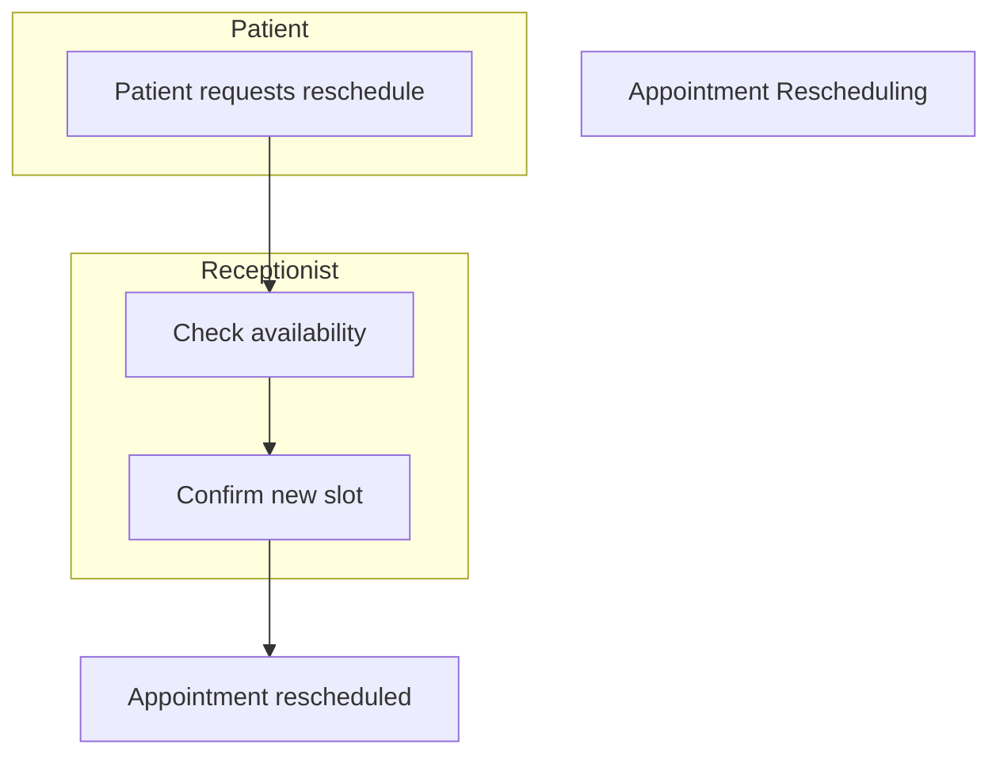

# Appointment Rescheduling

**Stakeholders:** Patients, Receptionists.
**Concerns:** Minimizing no-shows.
**Decisions:** Auto-suggests alternative slots.
**Stakeholder Benefit:** Reduces administrative burden for staff.
