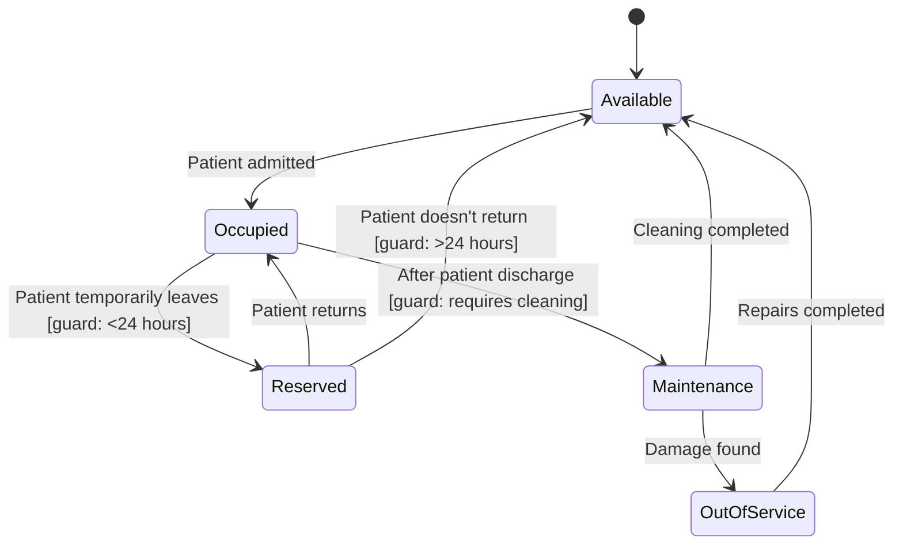

# Bed Object

```mermaid

stateDiagram-v2
    [*] --> Available
    Available --> Occupied: Patient admitted
    Occupied --> Reserved: Patient temporarily leaves [guard: <24 hours]
    Occupied --> Maintenance: After patient discharge [guard: requires cleaning]
    Reserved --> Occupied: Patient returns
    Reserved --> Available: Patient doesn't return [guard: >24 hours]
    Maintenance --> Available: Cleaning completed
    Maintenance --> OutOfService: Damage found
    OutOfService --> Available: Repairs completed

```
