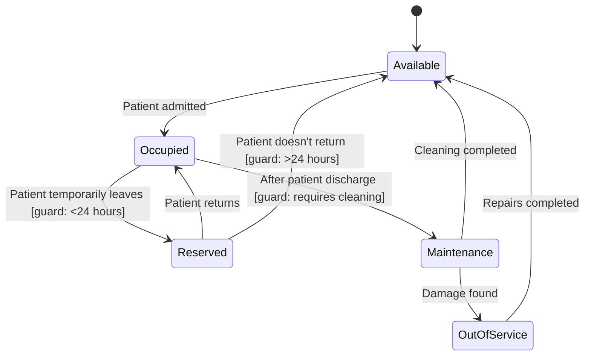

# Bed Object

**Key States:** Available, Occupied, Reserved, Maintenance, OutOfService

**Transitions:** Tracks bed utilization and maintenance needs

# Functional Requirements Mapping:

**FR-501:** Bed allocation system

**FR-502:** Infection control procedures

**FR-503:** Facility maintenance tracking

**FR-504:** Temporary bed reservation
