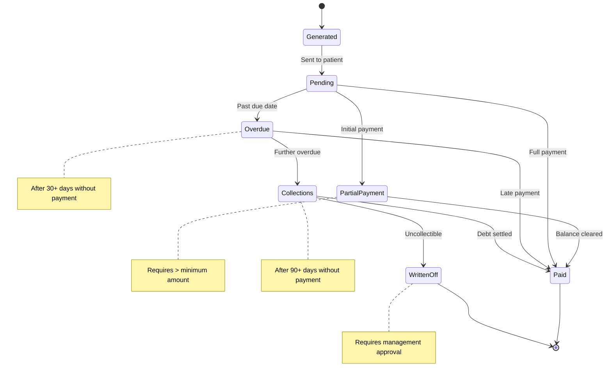

# Billing Invoice Object

 **Key States:** Generated, Pending, PartialPayment, Paid, Overdue, Collections, WrittenOff

**Transitions:** Financial workflow with payment tracking and collection process

# Functional Requirements Mapping:

**FR-701:** Invoice generation

**FR-702:** Payment processing

**FR-703:** Overdue account handling

**FR-704:** Financial reporting
