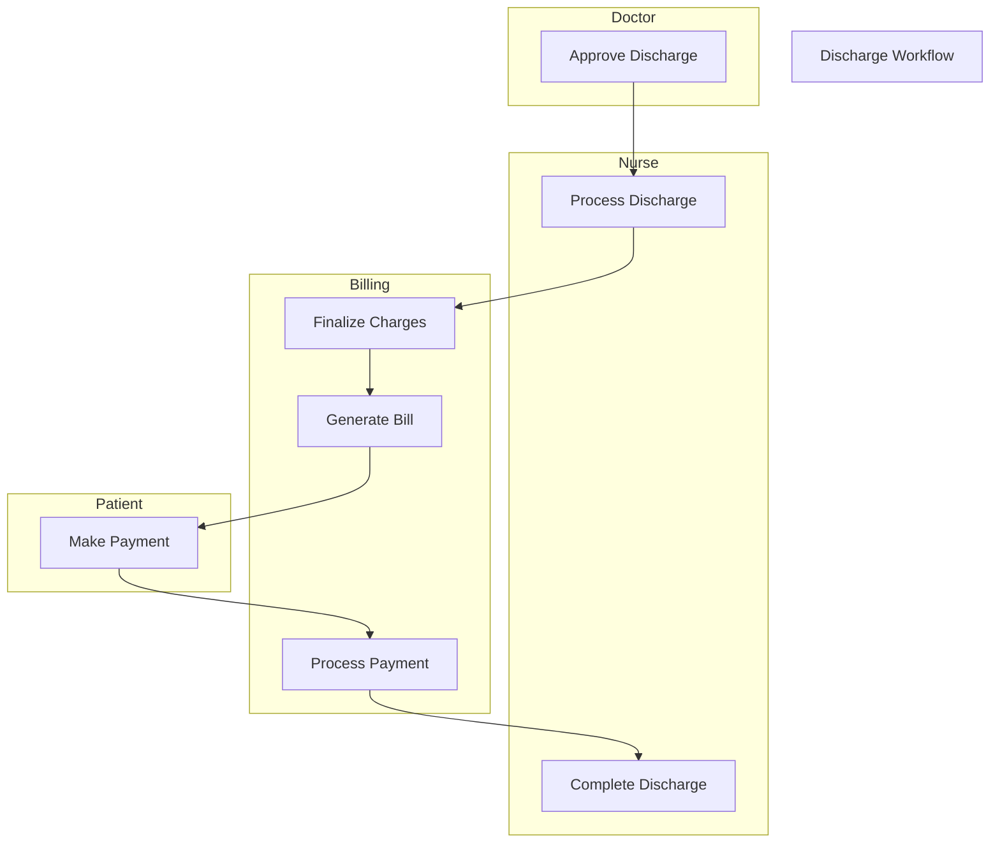

#  Discharge & Billing

**Stakeholders:** Patients, Billing, Nurses.
**Concerns:** Timely discharge, accurate billing.
**Parallel Actions:** Bed cleanup and billing occur concurrently.
**Stakeholder Benefit:** Reduces discharge delays for patients.
