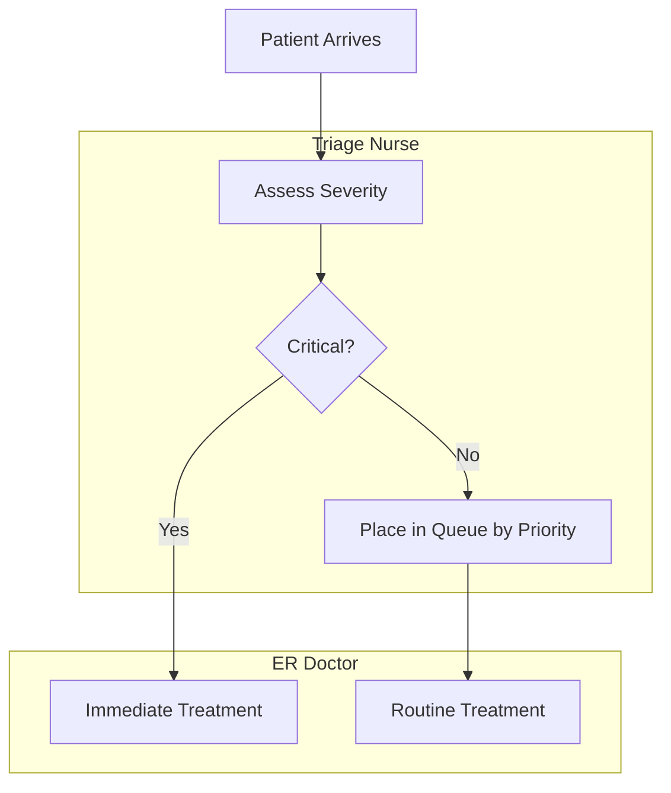

#  Emergency Room Triage

**Stakeholders:** ER Staff, Patients.
**Concerns:** Prioritization, life-threatening cases.
**Decisions:** Patients are routed based on severity.
**Stakeholder Benefit:** Ensures life-saving care is prioritized.
