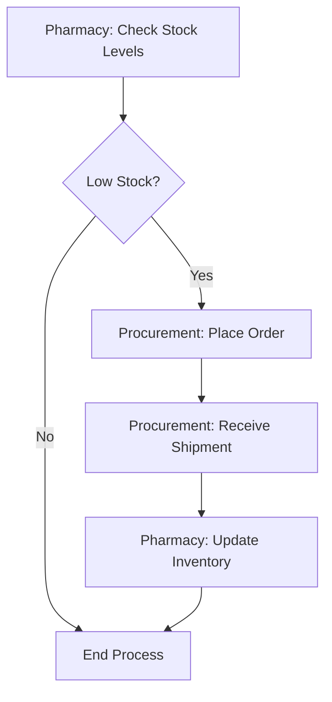

#  Inventory Replenishment

**Stakeholders:** Pharmacy, Procurement.
**Concerns:** Stockouts, overstocking.
**Automated Triggers:** System alerts procurement at threshold.
**Stakeholder Benefit:** Prevents stockouts for critical medications.
