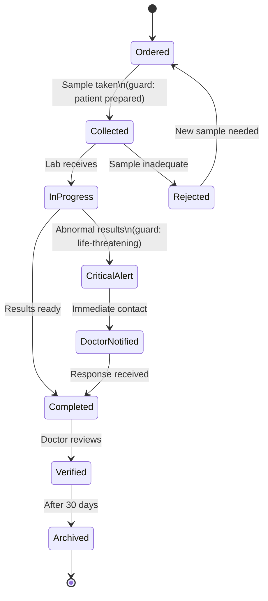

# Lab Test Object

**Key States:** Ordered, Collected, InProgress, Completed, Verified, Archived, Rejected, CriticalAlert, DoctorNotified

**Transitions:** Laboratory workflow with quality control and emergency handling

# Functional Requirements Mapping:

**FR-601:** Test ordering system

**FR-602:** Sample handling procedures

**FR-603:** Critical result notification

**FR-604:** Test result verification
