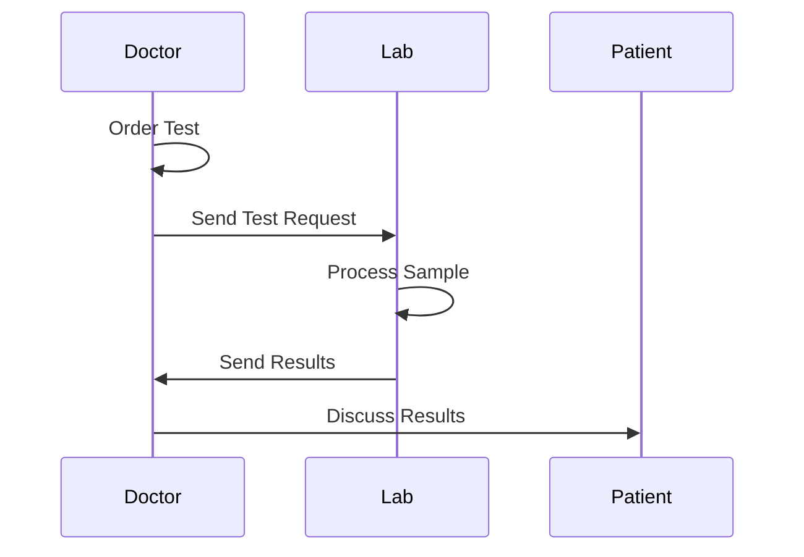

#  Lab Test Order & Processing

**Stakeholders:** Doctors, Lab Technicians, Patients.
**Concerns:** Turnaround time, result accuracy.
**Decisions:** Lab checks sample viability; if compromised, workflow restarts.
**Stakeholder Benefit:** Automated result delivery reduces manual errors for lab staff.
