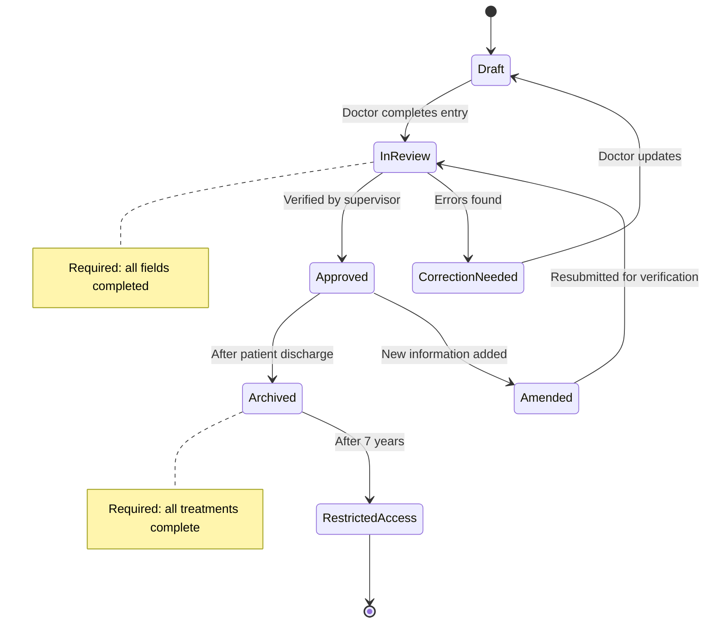

# Medical Record Object

**Key States:** Draft, InReview, Approved, CorrectionNeeded, Archived, RestrictedAccess, Amended

**Transitions:** Ensures proper documentation workflow with verification steps

# Functional Requirements Mapping:

**FR-301:** Electronic health record management

**FR-302:** Record verification process

**FR-303:** Data retention policy

**FR-304:** Record amendment procedure
