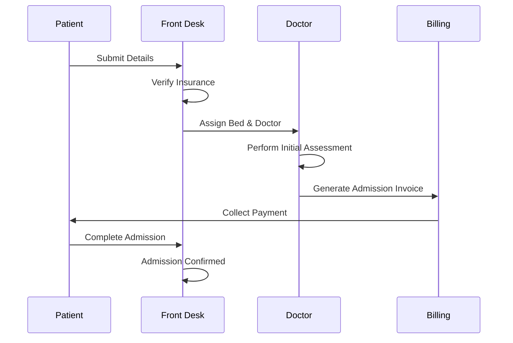

# Patient Admission Workflow

**Stakeholders:** Patients, Front Desk Staff, Doctors, Billing Department.
**Concerns:** Speed, accuracy, and compliance with hospital policies.
**Parallel Actions:** Insurance verification and bed assignment happen concurrently to reduce wait time.

**Decisions:** If insurance is invalid, the workflow branches to a manual review.

**Stakeholder Benefit:** Ensures patients are admitted quickly while maintaining billing accuracy.
