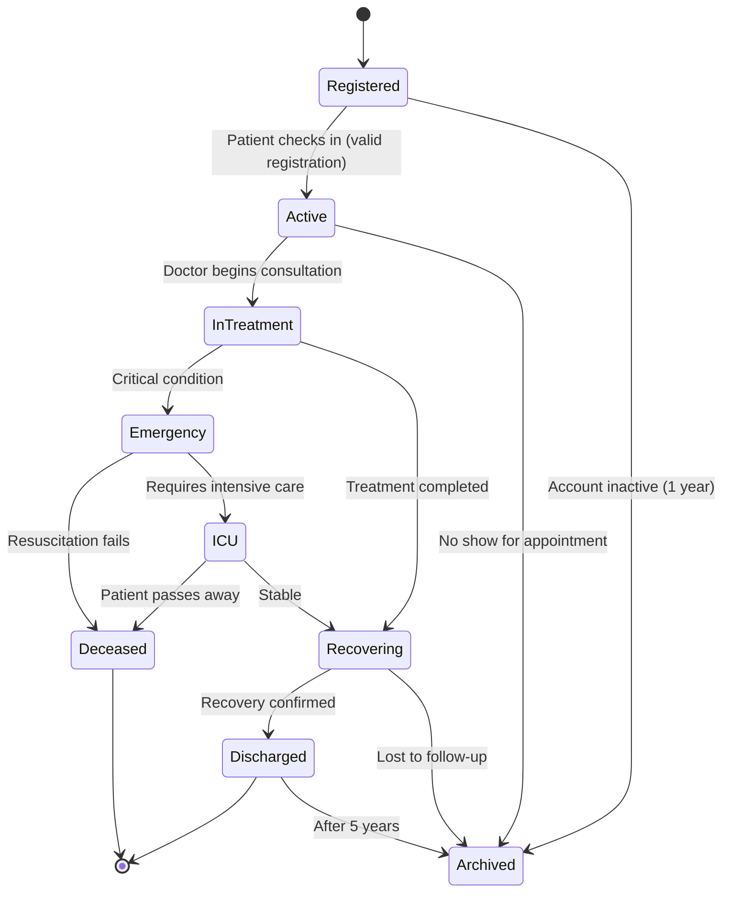

# Patient Object

**Key States:** Registered, Active, InTreatment, Recovering, Discharged, Emergency, ICU, Deceased, Archived

**Transitions:** Models the complete patient journey from registration through treatment to final disposition

# Functional Requirements Mapping:

**FR-101:** Patient registration system

**FR-102:** Treatment workflow management

**FR-103:** Emergency handling procedures

**FR-104:** Patient record archiving policy
