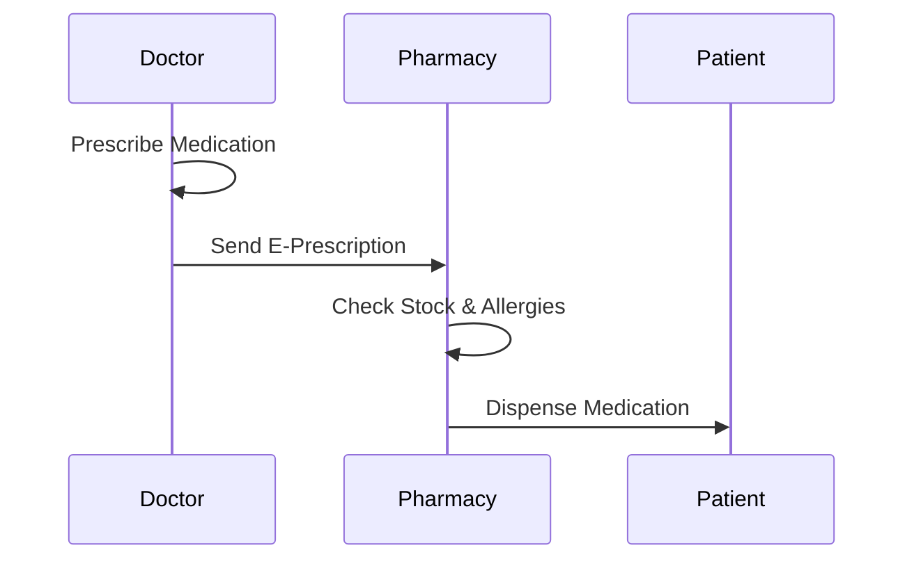

# Prescription & Pharmacy Dispensing

**Stakeholders:** Doctors, Pharmacists, Patients.
**Concerns:** Drug availability, allergy checks.
**Parallel Actions:** Stock and allergy checks occur simultaneously.
**Stakeholder Benefit:** Prevents dispensing errors, meeting patient safety needs.
