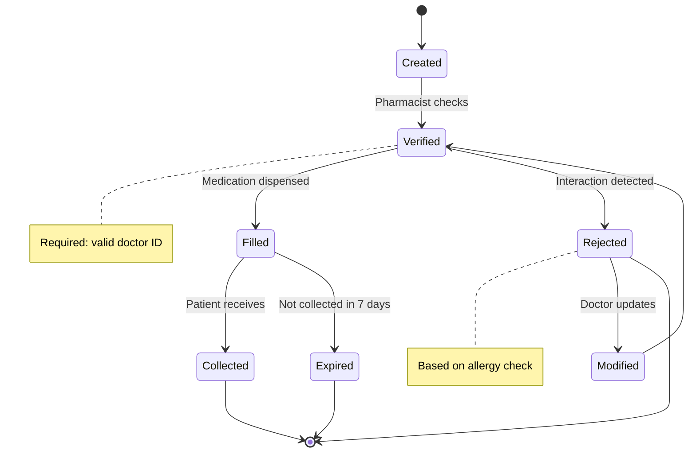

# Prescription Object

**Key States:** Created, Verified, Filled, Collected, Rejected, Modified, Expired

**Transitions:** Medication dispensing workflow with safety checks

# Functional Requirements Mapping:

**FR-401:** Prescription creation

**FR-402:** Drug interaction checking

**FR-403:** Dispensing workflow

**FR-404:** Prescription expiration handling
