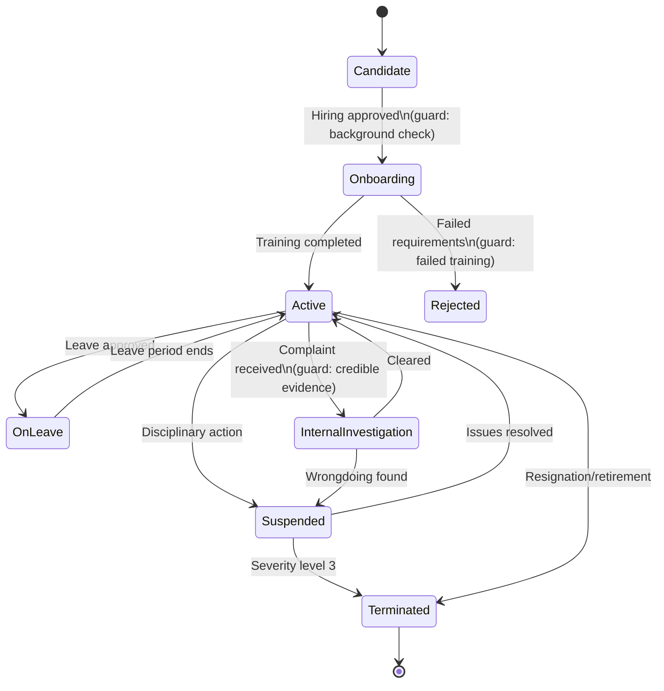

# Staff Member Object

**Key States:** Candidate, Onboarding, Active, OnLeave, Suspended, Terminated, Rejected, InternalInvestigation

**Transitions:** Complete HR lifecycle from hiring to termination

# Functional Requirements Mapping:

**FR-801:** Staff recruitment process

**FR-802:** Employee status tracking

**FR-803:** Disciplinary procedures

**FR-804:** Leave management
