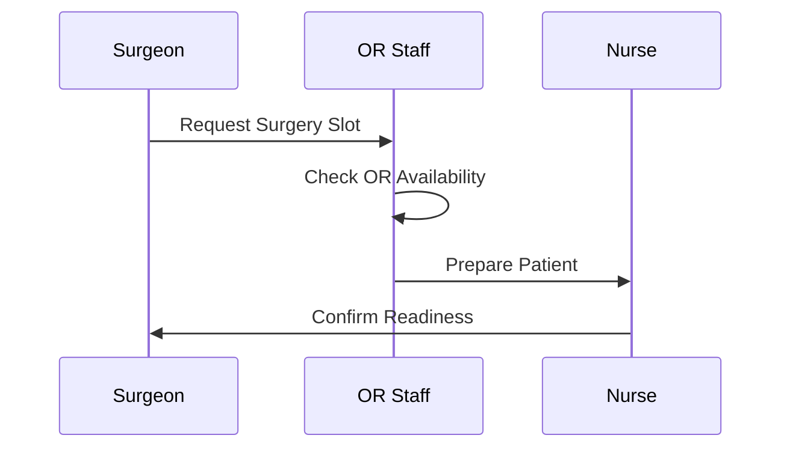

#  Surgery Scheduling

**Stakeholders:** Surgeons, Nurses, OR Staff.
**Concerns:** Resource conflicts, emergency prioritization.
**Decisions:** Emergency cases trigger rescheduling of elective surgeries.
**Stakeholder Benefit:** Dynamic scheduling meets surgeon and patient needs.
