```mermaid

graph TD


    %% Define actors
    subgraph Actors
        Patient
        Doctor
        Nurse
        Admin
        BillingStaff
        System
    end

    %% Define use cases
    subgraph UseCases
        PatientRegistration[Patient Registration]
        ScheduleAppointment[Schedule Appointment]
        AccessPatientPortal[Access Patient Portal]
        PayBill[Pay Bill]
        UpdateMedicalRecords[Update Medical Records]
        ViewDoctorSchedule[View Doctor Schedule]
        EmergencyOverride[Emergency Override]
        SecureMessaging[Secure Messaging]
        ManageAccessControl[Manage Access Control]
        GenerateBill[Generate Bill]
        SendNotifications[Send Notifications]
        LogUpdates[Log Updates]
    end

    %% Relationships
    Patient -->|Register| PatientRegistration
    Patient -->|Schedule Appointment| ScheduleAppointment
    Patient -->|Access Patient Portal| AccessPatientPortal
    Patient -->|Pay Bill| PayBill
    Doctor -->|Update Medical Records| UpdateMedicalRecords
    Doctor -->|View Doctor Schedule| ViewDoctorSchedule
    Doctor -->|Emergency Override| EmergencyOverride
    Nurse -->|Secure Messaging| SecureMessaging
    Admin -->|Manage Access Control| ManageAccessControl
    BillingStaff -->|Generate Bill| GenerateBill
    System -->|Send Notifications| SendNotifications
    System -->|Log Updates| LogUpdates

```

# Use Case Diagram: Hospital Management System
# Actors:
**Patient:** Registers, schedules appointments, views medical records, and pays bills.

**Doctor:** Manages appointments, updates medical records, and communicates with patients.

Nurse: Assists doctors and communicates with patients.

Admin: Manages system settings, user roles, and access control.

Billing Staff: Handles billing and insurance claims.

System: Automates notifications, reminders, and logs.

Use Cases:
Patient Registration:

Patient provides personal details (name, contact, medical history).

System generates a unique patient ID.

Mandatory fields are validated before submission.

Schedule Appointment:

Patient views real-time availability of doctors and rooms.

Patient books, reschedules, or cancels appointments.

System sends confirmation via email/SMS within 10 seconds.

Update Medical Records:

Doctor views and updates patient medical records.

System logs updates with timestamps and doctor’s name.

View Doctor Schedule:

Doctor views daily, weekly, or monthly schedules.

System sends automated reminders 1 hour before appointments.

Generate Bill:

System generates bills for consultations, tests, and treatments.

Patient views and pays bills online.

Insurance claims are processed within 1 hour.

Send Notifications:

System sends notifications for appointment reminders, test results, and billing.

Notifications are delivered via email/SMS within 5 seconds.

Secure Messaging:

Doctors, nurses, and staff send and receive encrypted messages.

Messages are delivered within 2 seconds.

Manage Access Control:

Admin configures role-based access control (RBAC).

Patients, doctors, and staff have restricted access based on roles.

Emergency Override:

Doctor overrides appointment schedules in emergencies.

System reschedules appointments and notifies affected patients within 5 minutes.

Access Patient Portal:

Patient logs in securely to view medical records, test results, and communicate with doctors.

All data is encrypted and accessible only to authorized users.

Use Case Diagram Description:
Patient interacts with:

Patient Registration

Schedule Appointment

Access Patient Portal

Pay Bill

Doctor interacts with:

Update Medical Records

View Doctor Schedule

Secure Messaging

Emergency Override

Nurse interacts with:

Secure Messaging

Admin interacts with:

Manage Access Control

Billing Staff interacts with:

Generate Bill

System automates:

Send Notifications

Log Updates (for medical records and emergency overrides)

